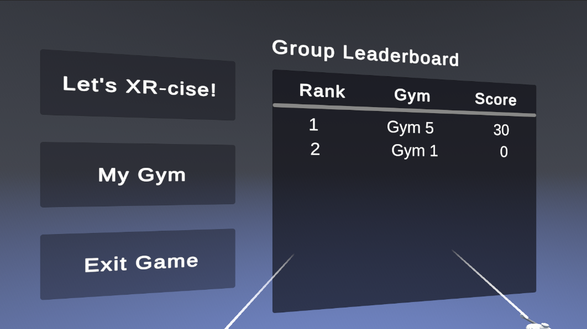

# XR-CiSE Setup Guide

Welcome to XR-CiSE! Follow the instructions below to get started with the application and begin your XR-cise journey.

---

## Prerequisites

1. **Install Meta Quest Link**  
   [Meta Quest Link Installation Guide](https://www.meta.com/help/quest/articles/headsets-and-accessories/oculus-rift-s/install-app-for-link/)

2. **Link Meta Quest Headset to your Windows Device**  
   [How to Connect with Air Link](https://www.meta.com/help/quest/articles/headsets-and-accessories/oculus-link/connect-with-air-link/)

---

## Installing XR-CiSE

1. **Download** `XRciSE Build.zip`.  
2. **Unzip** the file.  
3. Navigate to `MetaXR Build > XR-CiSE.exe`.

---

## Adding `XR-CiSE.exe` to the Meta Quest Link Library

1. After successfully linking your Meta Quest to Meta Quest Link, open the **Library**.  
2. Click the "+" sign.  
     
3. Click **"Add it here"**.  
     
4. Select `XR-CiSE.exe`.  
5. Run the app via Meta Quest Link.
     
---

## Loading the Game

1. **Create an Account/Login** using your Windows device.  
     

---

## Game Lobby Overview

### 1. **Welcome Page**  
     

### 2. **Weekly Progress Tracker**  
     

### 3. **Leaderboard**  
     
   - **"Let's XR-cise!"**: Loads XR-cise Instance.  
   - **My Gym**: Shows members of your gym group.  

---

## XR-Cise Gameplay Overview

1. When the game loads, you will see **two models**:  
   - **Green Model**: Represents your tracked pose.  
   - **Black Model**: The pose guide. Match this model's pose to get reps!  
     
     

---

## Gameplay Instructions

1. Your **Meta Quest headset and controllers** to track your pose.  
2. **Match the pose** of the guide model to earn reps.  
3. The model will cycle to a new pose once you're successful.  
   - **Tracking Pose Example**:  
       
   - **Pose Matched Successfully**:  
       
   - **Gameplay Feedback**:  
       

---

Have fun and XR-CiSE!
